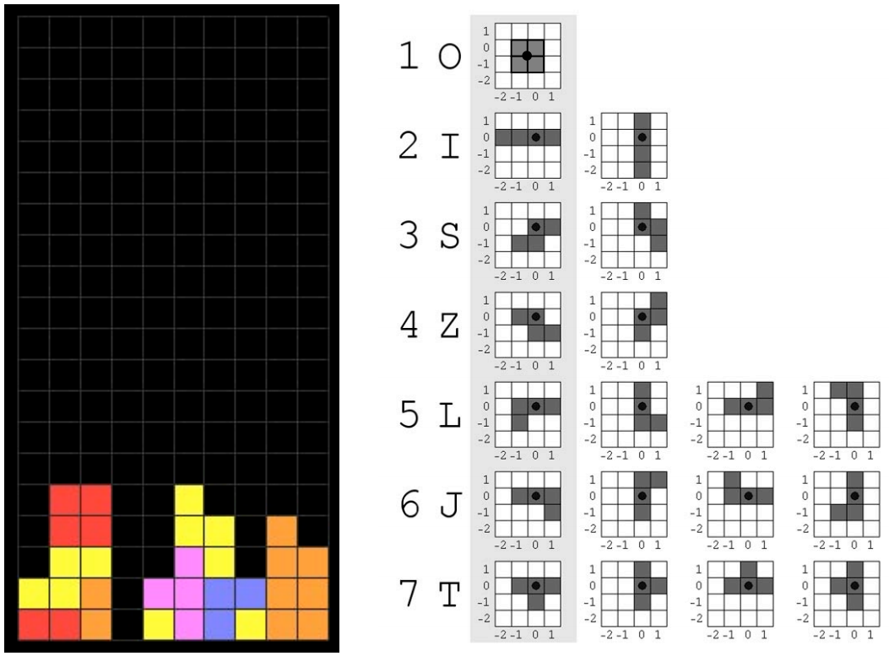

## 期中大作业  俄罗斯方块

一、作业内容
设计一个简化版的俄罗斯方块游戏。游戏窗口大小是20×10的方形棋盘格阵列（下图左），游戏中出现的方块共有7种（下图右），每种方块的旋转中心由黑点标出。留空代码“tetris.cpp”文件中针对L形状记录方块布局的数组vec2 allRotationsLshape[4][4]的设定请参看（下图右）中的第五行图示。

具体实现内容和步骤包括：
1. 方块/棋盘格的渲染和方块向下移动

创建OpenGL绘制窗口，然后绘制网格线来完成对棋盘格的渲染。随机选择方块并赋上颜色，从窗口最上方中间开始往下自动移动，每次移动一个格子。初始的方块类型和方向也必须随机选择，另外可以通过键盘控制方块向下移动的速度，在方块移动到窗口底部的时候，新的方块出现并重复上述移动过程。

2. 方块叠加

不断下落的方块需要能够相互叠加在一起，即不同的方块之间不能相互碰撞和叠加。另外，所有方块移动不能超出窗口的边界。

3. 键盘控制方块的移动

通过方向键（上/下/左/右）来控制方块的移动。按“上”键使方块以旋转中心顺（逆）时针旋转，每次旋转90°，按“左”和“右”键分别将方块向左/右方向移动一格，按“下”键加速方块移动。

4. 游戏逻辑

当游戏窗口中的任意一行被方块占满，该行即被消除，所有上面的方块向下移动一格子。当整个窗口被占满而不能再出现新的方块时，游戏结束。通过按下“q”键结束游戏，和按下“r”键重新开始游戏。
