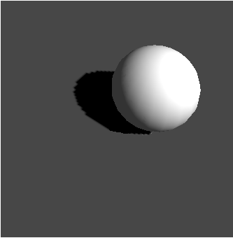

## 光照与阴影

实验内容
实现场景的光照和阴影。示例场景是一个球，需要达到的目标是实现对几何体的光照并以光源为投影中心生成阴影，如下图所示：

具体内容包括：
1. 场景绘制和背景色设置

创建OpenGL绘制窗口，然后参考实验2.2内容读入三维场景文件（实验课程提供正方体，球等简单几何体的*.off文件）并绘制。为了和后期的阴影颜色区分，将窗口背景色设置为灰色。

2. 添加光照效果

参考实验3.3或实验3.4，实现Phong光照效果。

3. 添加阴影效果

参考实验3.2，以步骤2中的光源位置作为投影中心，自定义投影平面（为计算方便，推荐使用y=0平面），计算阴影投影矩阵，为三维物体生成阴影。

4. 鼠标交互控制光源位置并更新阴影

参考实验2.1，加上鼠标点击，控制光源位置并更新光照效果。另外，由于光源位置同时表示投影中心，所以同时计算三维物体的阴影。
