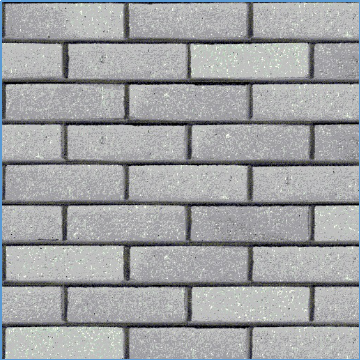
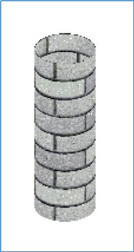
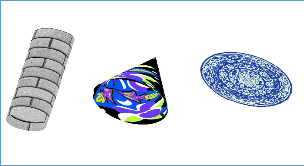

## 光照与阴影

实验内容
实例代码中已经实现了My_Mesh::generate_cylinder()函数，该函数生成一个圆柱体曲面，将该曲面贴上纹理后效果如下：

请实现
void My_Mesh::generate_disk()；
void My_Mesh::generate_cone()；
生成圆盘的几何和纹理坐标，生成圆锥的几何和纹理坐标，使得圆盘表面纹理显示为texture/ disk.jpg中的圆盘；使得圆锥表面纹理显示为texture/ cone.jpg中的三角图形。参考实验效果如下：

### 此外在Linux环境下还需手动编译FreeImage库
从[官网](http://freeimage.sourceforge.net/download.html)下载后解压，进入FreeImage目录，打开README.linux文档，按文档指示操作即可。（这中间有个坑，需要手动改某些与C++11新标准冲突的变量）

最后修改下CMakeLists.txt文件。